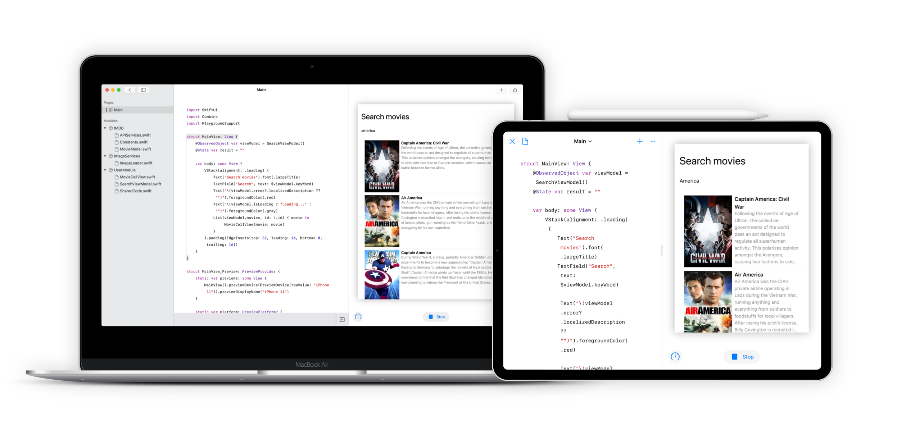

# ThemovieDB
This project demonstrates how to use **SwiftUI** &amp; **Combine** to implement a simple App under **MVVM** architecture. App has been developed by **Playgrounds** that is available on **iPadOS** & **MacOS**.

# Getting started
Please watch a walkthrough video on youtube: [https://youtu.be/-x5Een2wdss](https://youtu.be/-x5Een2wdss)  
If you really love it & wanna try to run on your device, then follow these bellow steps:

## Install Playgrounds
Make sure that you're owning a Macbook or iPad then download the **Playgrounds** App from the Appstore:
1. For MacOS: [https://apps.apple.com/app/id1496833156](https://apps.apple.com/app/id1496833156)
2. For iPadOS: [https://apps.apple.com/app/id908519492](https://apps.apple.com/app/id908519492)

## Download project
Download the ***ThemovieDB.playgroundbook*** from this repository then:
1. For MacOS: Go to ***File*** then choose ***Import Playgrounds***
2. For iPadOS: Send that file via Airdrop and open.

## Before running
To improve performance, please disable the **Enable Results** feature before running project

